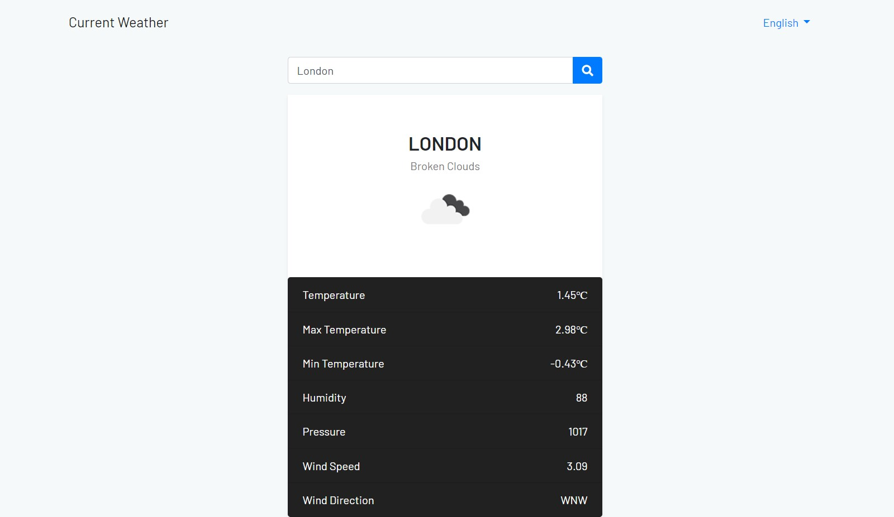
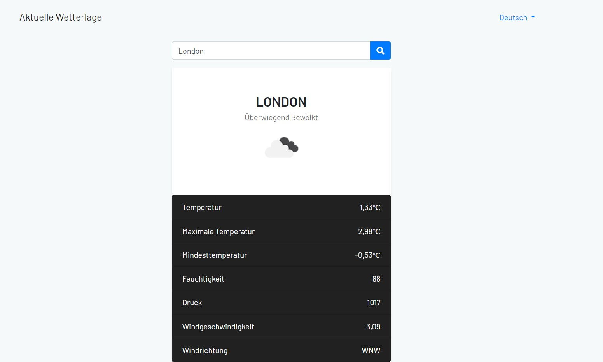

# WeatherCheck
A multilingual django web application to check current weather of Cities worldwide using <a href="https://openweathermap.org/api">OpenWeather API</a>

## Features
- Multi-Languages (English, French, Deutsch)
- Results caching (configurable using CACHE_TIMEOUT in `.env_sample` )

## Usage

At root:
- Create free account on [OpenWeatherAPI](https://openweathermap.org/price "OpenWeatherAPI") 
- Rename `.env_sample` as `.env` and replace API_KEY in `.env`
- In the command line run: 

	`docker-compose up --build -d`

- Navigate to http://localhost:8000/ for accessing the page.
